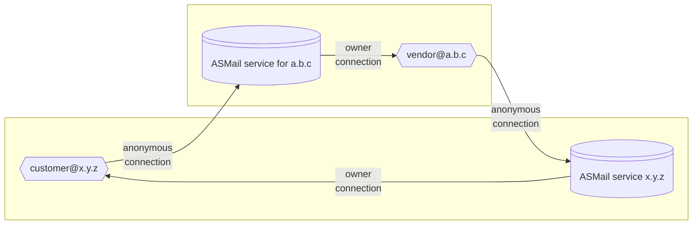

# Spec Server

This repository contains 3NWeb protocols' specification test suite and a single-machine server implementation, conforming to spec's suite.
Thus, we call it a spec server.

Main purpose of this server is to ensure that 3NWeb protocols are implementable, and to be a testbed for possible new features.
Secondary purpose of this server is to be packagable into a home-class server, i.e. server that can be run from a single machine.

## Build & Test

To use this repo, you need [Node.js](https://nodejs.org/).

When in the project's folder, run
```
npm ci
```
to pull in all necessary dependencies. Note that option `ci` brings exact versions, mentioned in `package-lock.json`, while option `i` (`install`) may get other versions, based on ranges in `package.json`.

After that, run npm scripts:
```
npm run test
```
to build everything and to run test suites. Or,
```
npm run build
```
to just do built.

Tests are written with [Jasmine](https://jasmine.github.io/).
Config file is `src/tests/jasmine.ts`.

Please note, that support for running server on windows hasn't been introduced, yet.

## ASMail (Authenticated Secure Mail) protocol overview



# License

Code is provided here under GNU General Public License, version 3.

All protocols (spec API calls to server) are free for anyone to use, to implement, to do anything with it.
We specifically *do not* subscribe to USA's court's concept that API is copyrightable.
